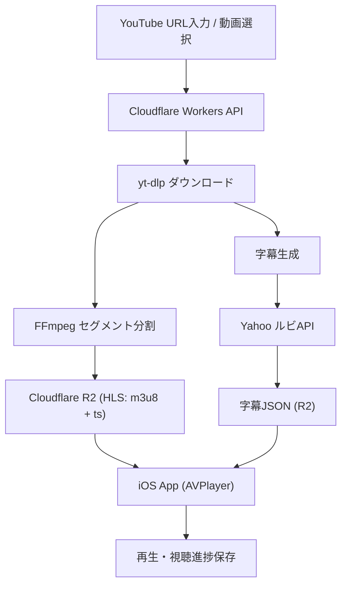

# 📺 日本語シャドーイング練習アプリ

## 📝 概要
このアプリは、日本語学習者向けに開発した動画ベースの学習アプリです。
YouTube動画を利用し、字幕・ルビ（ふりがな）・再生機能を組み合わせて、効率的なシャドーイング学習を実現します。

動画の再生だけでなく、単語検索、再生速度調整、視聴進捗の保存など、学習体験を最適化する機能を提供しています。

---

## ✨ 主な機能（Features）

- 🎬 動画ストリーミング再生（HLS / m3u8）
- 📝 字幕表示＋ルビ（ふりがな）対応
- 🔍 単語タップでシステム辞書検索
- ⏱ 再生速度、字幕のサイズ、字幕の色変更
- 📌 視聴進捗の自動保存・復元
- 🔔 動画処理完了後に通知
- 🎨 サムネイルを活用した美しいブラー背景UI
- 🇺🇸 英語字幕に対する音標（発音記号）対応

---

## ⚙️ 処理フロー（Pipeline）

1. ユーザーが動画リンクを入力、またはリストから動画を選択
2. バックエンドAPIにリクエストを送信し、動画情報をデータベースに登録
3. `yt-dlp` を使用して動画をダウンロード
4. `FFmpeg` により動画を6秒ごとのセグメント（.ts）に分割
5. 分割された動画を Cloudflare R2 にアップロード（HLS形式）
6. 字幕データを生成し、Yahooのルビ振りAPIで漢字にふりがなを付与（https://jlp.yahooapis.jp/FuriganaService/V2/furigana）
7. 字幕JSONをR2にアップロード
8. 動画処理完了後、アプリに通知を送信
9. ユーザーは動画を再生し、再生速度や進捗がデータベースに保存される
10. 次回再生時に視聴位置を復元

---

バックエンドからフロントエンドまでの処理フローを以下に示します。
## 🧩 システム構成（Architecture）

---

## 🛠 技術スタック（Tech Stack）

- 📦 動画ストレージ：Cloudflare R2
- 🗄 データベース：Cloudflare D1
- ⚙️ バックエンド：Cloudflare Workers
- 🔤 ルビ振りAPI：Yahoo Furigana API
- 📱 アプリケーション：Swift（SwiftUI）
- 🎥 動画処理：FFmpeg / yt-dlp

---

## 📱 画面プレビュー

| | | |
|---|---|---|
|  |  |  |
|  |  |  |
|  |  |  |

---

## ⚠️ 注意事項（Disclaimer）

本アプリは個人の学習および技術検証を目的として開発されたものです。
動画コンテンツの著作権は各権利者に帰属します。
取得した動画データについては、長期保存を行わず、一定期間経過後に削除しています。

YouTube等の外部サービスから取得したコンテンツの利用については、各サービスの利用規約および関連法令を遵守する必要があります。

本プロジェクトは教育・研究用途のサンプルとして公開しており、第三者への配布や商用利用は想定していません。
